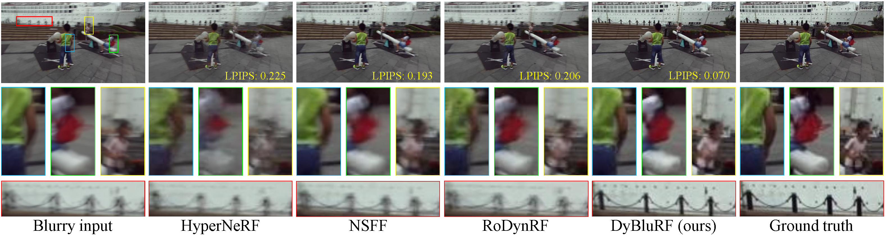

# DyBluRF: Dynamic Neural Radiance Fields from Blurry Monocular Video (CVPR 2024)
[Huiqiang Sun](https://huiqiang-sun.github.io/)<sup>1</sup>,
[Xingyi Li](https://xingyi-li.github.io/)<sup>1</sup>,
[Liao Shen](https://leoshen917.github.io/)<sup>1</sup>,
[Xinyi Ye](https://scholar.google.com/citations?hl=en&user=g_Y0w7MAAAAJ)<sup>1</sup>,
[Ke Xian](https://kexianhust.github.io/)<sup>2</sup>,
[Zhiguo Cao](http://english.aia.hust.edu.cn/info/1085/1528.htm)<sup>1*</sup>,

<sup>1</sup>School of AIA, Huazhong University of Science and Technology, <sup>2</sup>School of EIC, Huazhong University of Science and Technology

### [Project](https://huiqiang-sun.github.io/dyblurf) | [Paper](https://arxiv.org/abs/2403.10103) | [Video](https://www.youtube.com/watch?v=0cwJyDC40vw) | [Supp](https://arxiv.org/abs/2403.10103)



This repository contains the official PyTorch implementation of our CVPR 2024 paper "DyBluRF: Dynamic Neural Radiance Fields from Blurry Monocular Video".

## Installation
```
git clone https://github.com/huiqiang-sun/DyBluRF.git
cd DyBluRF
conda create -n dyblurf python=3.7
conda activate dyblurf
pip install -r requirements.txt
```
## Training
```
python train.py --config configs/xxx.txt
```

# Citation
If you find our work useful in your research, please consider to cite our paper:
```
@article{sun2024_dyblurf,
    title={DyBluRF: Dynamic Neural Radiance Fields from Blurry Monocular Video},
    author={Sun, Huiqiang and Li, Xingyi and Shen, Liao and Ye, Xinyi and Xian, Ke and Cao, Zhiguo},
    journal={arXiv preprint arXiv:2403.10103},
    year={2024}
}
```
